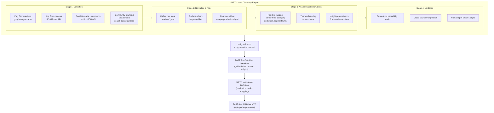
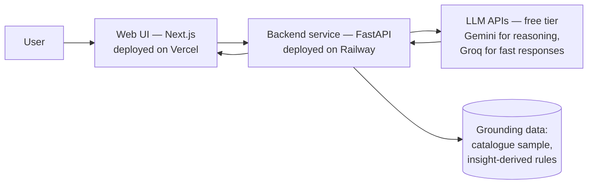

# Architecture — Blinkit Category-Exploration Project

> System architecture for the full project pipeline, centered on the **Part 1
> AI-Powered Discovery Engine** and its downstream connections to Parts 2–4.
> Context: `context.md` · Problem framing: `PROBLEM_STATEMENT.md`

---

## 1. Design Goals

The architecture is shaped by five non-negotiables (from `context.md` guardrails and
working directives):

1. **Real pipeline, not a one-off analysis** — repeatable stages with persisted
   intermediate outputs, so any stage can be re-run independently.
2. **Purpose-built for cross-category barriers** — every stage filters and analyzes
   toward one question: *why don't customers purchase from other categories?* This is
   not generic sentiment analysis.
3. **Evidence traceability** — every insight must be traceable back through
   theme → tagged item → raw quote → source URL. No orphan claims.
4. **Validated insight quality** — the pipeline includes an explicit validation stage
   (triangulation + human spot-checks), not just generation.
5. **Anonymity** — no personal details of the project owner in any file, config,
   commit, or deployed artifact.

---

## 2. System Overview



---

## 3. Part 1 — Discovery Engine Architecture

### 3.1 Stage 1: Data Collection

Each source has its own collector module writing to a common raw format. Feasibility
is assessed honestly per source — traceability requires knowing exactly how each
dataset was obtained.

| Source | Method | Feasibility | Collector |
|---|---|---|---|
| **Google Play reviews** | `google-play-scraper` (Python) against the Blinkit app id | High — thousands of reviews, sortable by recency/rating | `collectors/play_store.py` |
| **Apple App Store reviews** | iTunes RSS review feed / `app-store-scraper` | Medium — limited to recent pages per country | `collectors/app_store.py` |
| **Reddit** | Public JSON API (`/search.json`, subreddit + keyword queries: r/india, r/indiasocial, r/bangalore, r/delhi, r/mumbai, quick-commerce threads) | High — rich discussion data; respects rate limits | `collectors/reddit.py` |
| **Community forums / quick-commerce discussions** | Web search + targeted fetch of public threads (e.g., Team-BHP-style forums, LocalCircles-type surveys reported publicly) | Medium — curated, smaller volume | `collectors/forums.py` |
| **Social media (X/Twitter)** | API is locked down; fallback = search-engine surfaced public posts, manually curated with URLs | Low–Medium — supplementary only, clearly labeled | `collectors/social.py` |
| **Product reviews** | In-app product reviews are not publicly scrapable at scale; proxy = category-specific complaints inside app-store/Reddit data, tagged as such | Proxy | (derived tag) |

**Collection is keyword-steered toward the research goal**, not just "Blinkit"
mentions. Query families include: reorder/habit language ("same order", "weekly
order"), category-avoidance language ("never buy X on Blinkit", "only use it for"),
channel-preference language ("chemist", "Nykaa", "Amazon for", "local store"),
trust/quality language ("expiry", "fake", "fresh", "quality"), and discovery language
("didn't know Blinkit sells", "found out they have").

**Raw record schema** (every collector emits this):

```json
{
  "id": "src-hash",
  "source": "play_store | app_store | reddit | forum | social",
  "source_url": "https://…",
  "author_handle": "anonymized-or-omitted",
  "date": "ISO-8601",
  "rating": "1-5 | null",
  "text": "verbatim user text",
  "context": "thread title / app version / query that surfaced it",
  "collected_at": "ISO-8601",
  "collection_method": "scraper | api | curated"
}
```

### 3.2 Stage 2: Normalization & Relevance Filtering

- **Dedupe** on text similarity (near-duplicate reviews are common on app stores).
- **Clean**: strip emoji noise, normalize whitespace; keep original text intact in a
  `text_raw` field — analysis quotes must be verbatim.
- **Language**: keep English + Hinglish (a large share of real Indian user voice is
  Hinglish; discarding it would bias the dataset).
- **Relevance filter (two-pass)**:
  1. Cheap keyword pass — drop items with zero category/shopping-behavior signal
     (e.g., pure delivery-boy complaints, app-crash-only reviews) but **keep** items
     that explain *why* users limit usage, even if negative about ops (trust issues
     are a hypothesized barrier).
  2. LLM-based relevance scoring on the remainder (Groq — fast + free tier suits
     high-volume classification): `relevant_to_category_behavior: yes / partial / no`
     with a one-line rationale. Only `yes/partial` proceed.

Output: `data/clean/corpus.jsonl` — the analysis corpus, with per-item provenance.

### 3.3 Stage 3: AI Analysis Layer (Gemini + Groq, free tier)

Three sub-stages, each a separate scripted step with persisted output — so themes can
be regenerated without re-tagging, and insights without re-clustering.

**(a) Structured tagging** — every corpus item gets:

```json
{
  "id": "…",
  "barriers": ["habit_loop", "low_awareness", "trust_quality", "price_perception",
                "discovery_friction", "missing_information", "assortment_gap", "none"],
  "categories_mentioned": ["groceries", "personal_care", "pet_supplies", "…"],
  "channel_alternatives": ["chemist", "nykaa", "amazon", "local_store", "…"],
  "discovery_mode": "search | reorder | browse | promo | word_of_mouth | accidental | null",
  "segment_hints": ["metro", "family", "bachelor", "pet_owner", "parent", "…"],
  "sentiment": "positive | negative | mixed | neutral",
  "key_quote": "verbatim excerpt",
  "maps_to_hypotheses": ["H1", "H2", "H3", "H4", "H5"]
}
```

The barrier taxonomy starts from the five hypotheses in `context.md` (H1 habit loops,
H2 low awareness, H3 trust/quality anxiety, H4 discovery friction, H5 missing
information) **plus an open `other/emergent` slot** — the taxonomy must be allowed to
grow from the data, otherwise the pipeline only confirms what we already believed.

**(b) Theme clustering** — tagged items are grouped into themes across sources.
A theme is only admitted if it has **≥ N supporting items from ≥ 2 distinct sources**
(triangulation threshold, tuned to corpus size). Each theme record stores its full
evidence list (item ids → quotes → URLs).

**(c) Insight generation** — themes are synthesized into answers to the **8 research
questions** from the brief. Every insight cites its themes; every theme cites its
quotes. Output includes a **hypothesis scorecard**: for H1–H5, evidence strength
(strong / moderate / weak / contradicted) + emergent hypotheses discovered in (a).

**Model usage (free-tier split by workload):**

- **Tagging (a)** → **Groq** (Llama-class model, low temperature): high-volume,
  per-item structured JSON output — Groq's fast inference + generous free-tier rate
  limits fit this batch workload. Tagging prompts include the fixed taxonomy + 3–5
  gold examples.
- **Clustering + synthesis (b, c)** → **Google Gemini** (via AI Studio free tier):
  long-context reasoning over the full tagged corpus and themes — Gemini's large
  context window handles cross-corpus clustering in few calls, staying inside free
  daily quotas. Synthesis prompts receive themes with evidence, not raw corpus
  (keeps output grounded and auditable).
- **Rate-limit strategy:** batch requests, exponential backoff, and persisted
  intermediates mean a quota hit only pauses a stage — never forces a full re-run.

### 3.4 Stage 4: Insight Quality Validation

This is a required deliverable ("how you validated the quality of the insights"):

1. **Traceability audit** — automated check: every insight → ≥1 theme → ≥N quotes with
   live source URLs. Any orphan insight fails the build of the report.
2. **Cross-source triangulation** — themes supported by only one source type are
   flagged `single-source` and reported with lower confidence, never silently promoted.
3. **Human spot-check** — a random sample (~10–15%) of tagged items is manually
   reviewed for tag correctness; the observed agreement rate is reported in the
   engine's methodology section.
4. **Counter-evidence pass** — for each major insight, the LLM is explicitly prompted
   to search the corpus for contradicting quotes; contradictions are surfaced in the
   report rather than smoothed over. Running this pass on a *different* model than the
   one that generated the insight (Gemini checks Groq-tagged themes and vice versa)
   adds a cheap cross-model consistency check — free with a two-provider stack.
5. **Primary-research validation (Part 2)** — the ultimate check: interviews are
   designed to independently test the top AI insights.

### 3.5 Part 1 Outputs

- `data/raw/` — per-source raw collections (JSON)
- `data/clean/corpus.jsonl` — deduped, filtered, provenance-preserving corpus
- `data/analysis/tags.jsonl`, `data/analysis/themes.json` — intermediate analysis
- `outputs/INSIGHTS_REPORT.md` — themed insights answering the 8 questions, with
  evidence tables and the hypothesis scorecard
- `outputs/METHODOLOGY.md` — how data was gathered/analyzed/validated (submission
  requirement)

---

## 4. Part 2 — User Research (architecture of the handoff)

The discovery engine's outputs directly generate the research instruments:

- **Segment selection**: the `segment_hints` distribution + hypothesis scorecard
  determine which segment to interview (e.g., "metro family shoppers who reorder
  weekly but buy personal care elsewhere").
- **Interview guide**: each top AI insight becomes a *non-leading* interview topic;
  the guide tests insights without revealing them.
- **Synthesis**: interview notes are coded with the **same barrier taxonomy** as
  Stage 3a, enabling a direct AI-vs-primary-research comparison matrix.

Artifacts: `research/INTERVIEW_GUIDE.md`, `research/notes/*`,
`research/SYNTHESIS.md`.

## 5. Part 3 — Problem Definition (architecture of the synthesis)

A structured document assembled from Parts 1+2:

- Target segment (from interview validation)
- Root cause (the barrier(s) that survived both AI analysis and interviews)
- Existing workarounds (observed channel alternatives from tags + interviews)
- User value & business value (tied to `context.md` metrics)
- **Confirm/contradict matrix**: each AI insight × interview evidence →
  `confirmed / partially confirmed / contradicted / untested`

Artifact: `outputs/PROBLEM_DEFINITION.md`.

## 6. Part 4 — AI-Native MVP (provisional architecture)

> Final shape depends on the validated root cause (guardrail: MVP must map to it).
> This section fixes the *infrastructure* pattern now; the *feature* is decided after
> Part 3.

**Pattern:** thin web app + free-tier LLM API backend, deployed to production on
**Vercel (frontend) + Railway (backend)**.



**Infrastructure decisions (fixed now):**

- **Deployment — Vercel + Railway (both free tier), public URLs = "production":**
  - **Vercel** hosts the Next.js frontend (hobby tier; simple MVPs can also use
    Vercel API routes alone if the backend stays thin).
  - **Railway** hosts the Python/FastAPI backend when one is needed (LLM
    orchestration, grounding-data lookups) — free trial/starter tier is sufficient
    for an MVP demo load.
  - Deployed under a **neutral project name**; no personal identifiers in the URL,
    repo name, page metadata, or commit history (anonymity directive).
- **LLM layer**: Gemini (AI Studio free tier) for reasoning-heavy calls; Groq free
  tier for latency-sensitive interactive responses. Provider choice per endpoint is a
  config flag, so quota exhaustion on one provider degrades gracefully to the other.
- **Secrets**: Gemini/Groq API keys via Vercel/Railway environment variables, never
  in the repo.
- **Grounding**: the MVP uses a curated Blinkit catalogue sample + rules derived from
  validated insights, so its AI behavior demonstrably descends from the research.
- **Non-negotiable UX guardrail**: whatever the feature is, it must not add friction
  to the core reorder loop — discovery is additive, never blocking.

**Candidate MVP shapes** (choose after Part 3): in-context category-bridge
recommender ("people with your basket also solved X with Y"), trust-builder overlay
for first-time category purchase (answers the missing-information barrier), or an
awareness agent that converts an existing shopping list into cross-category
suggestions. **Decision deferred by design.**

---

## 7. Repository Layout

```
Final Grad Project - Blinkit/
├── PROBLEM_STATEMENT.md
├── context.md
├── ARCHITECTURE.md              ← this file
├── pipeline/
│   ├── collectors/              # Stage 1: one module per source
│   ├── processing/              # Stage 2: dedupe, clean, relevance filter
│   ├── analysis/                # Stage 3: tagging, theming, insight generation
│   ├── validation/              # Stage 4: traceability audit, spot-check tooling
│   └── run.py                   # Orchestrator: run stages independently or end-to-end
├── data/
│   ├── raw/                     # Per-source raw JSON (gitignored if large)
│   ├── clean/                   # corpus.jsonl
│   └── analysis/                # tags.jsonl, themes.json
├── outputs/
│   ├── INSIGHTS_REPORT.md
│   ├── METHODOLOGY.md
│   └── PROBLEM_DEFINITION.md
├── research/
│   ├── INTERVIEW_GUIDE.md
│   ├── notes/
│   └── SYNTHESIS.md
└── mvp/                         # Part 4 app (own README + deploy config)
```

---

## 8. Key Architectural Decisions (ADR summary)

| # | Decision | Rationale |
|---|---|---|
| 1 | Staged pipeline with persisted intermediates | Re-runnable, debuggable, and demonstrates "how the workflow gathers and analyzes data" — a grading requirement |
| 2 | Python scripts + free-tier LLM APIs — Gemini + Groq (no n8n/Zapier, no paid APIs) | Zero-cost stack; full control over schemas and traceability; everything reviewable as code |
| 2a | Two-provider LLM split: Groq for high-volume tagging, Gemini for long-context synthesis | Matches each free tier's strengths (Groq: fast batch classification; Gemini: large context window); enables cross-model counter-evidence checks; graceful fallback if one quota is exhausted |
| 3 | Barrier taxonomy seeded from hypotheses + open emergent slot | Tests H1–H5 without confirmation bias |
| 4 | Triangulation threshold (≥2 source types per theme) | Prevents single-source artifacts (e.g., app-store rating-bomb waves) from becoming "insights" |
| 5 | Verbatim-quote traceability enforced by an automated audit | Evidence-backed insights are a stated guardrail; automation makes it provable |
| 6 | Same taxonomy reused for interview coding | Makes the Part 3 confirm/contradict matrix mechanical instead of impressionistic |
| 7 | MVP feature decision deferred until after Part 3 | Guardrail: MVP must map to the *validated* root cause, not a premature guess |
| 8 | Neutral naming + env-var secrets across all artifacts | Anonymity directive + basic security hygiene |

---

## 9. Risks & Mitigations

| Risk | Mitigation |
|---|---|
| App-store reviews skew toward delivery/ops complaints, not category behavior | Keyword-steered collection + two-pass relevance filter; Reddit/forums carry the discussion-rich signal |
| X/Twitter data inaccessible at scale | Treated as supplementary, curated with URLs, labeled as such — never load-bearing for a theme on its own |
| LLM tagging errors propagate into insights | Low-temperature tagging with gold examples; 10–15% human spot-check with reported agreement rate |
| Confirmation bias toward the five seeded hypotheses | Emergent-tag slot + mandatory counter-evidence pass |
| Interviews contradict AI insights | By design: contradiction is documented in the confirm/contradict matrix (guardrail from `context.md`) |
| LLM free-tier rate limits (Gemini daily quotas, Groq RPM caps) during batch analysis | Batching + exponential backoff; persisted intermediates so a quota pause never forces a re-run; workload split across two providers |
| Free-tier deployment limits for MVP (Vercel hobby, Railway starter) | Thin app pattern; LLM APIs do the heavy lifting; no persistent DB required for MVP v1; Railway used only if a Python backend is genuinely needed |
