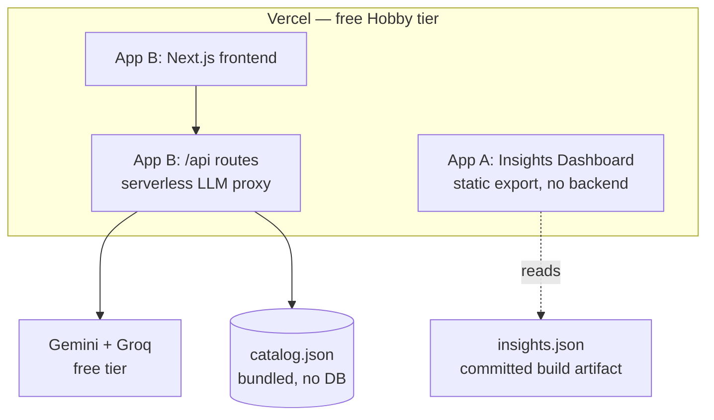

# Deployment Plan — Blinkit Category-Exploration Project

> How the two user-facing artifacts get to production, on free infrastructure,
> without leaking identity. Companion to `ARCHITECTURE.md` (§6) and
> `IMPLEMENTATION_PLAN.md` (Phase 7–8). Edge cases referenced: M1–M14, X5.

---

## 1. What Gets Deployed

Two **separate** applications with very different runtime needs. Conflating them is
the most common way this kind of project breaks at grading time.

| # | App | Purpose | Source design | Runtime need |
|---|---|---|---|---|
| **A** | **Category Discovery Insights** — the reviews/insights dashboard | Visualizes **Part 1** output: themes, barriers, hypothesis scorecard, evidence quotes, the 8 research questions | `stitch_category_discovery_insights/` (desktop, 260px fixed sidebar, Inter, #F8CB46 accent) | **None at runtime** — reads pre-generated JSON |
| **B** | **Blinkit Discover** — the AI MVP (Cart-Completion Interceptor) | **Part 4** deliverable: intercepts the cart and surfaces one grounded cross-category suggestion | `stitch_blinkit_ai_category_discovery/` (5 screens incl. cart review, discovery feed, order success) | **Live LLM calls** (Gemini/Groq) + catalogue grounding |

**The key asymmetry:** App A is a *static site*. App B needs a *server*. Treating A as
static removes it entirely from the fragile-infrastructure category.

---

## 2. Recommended Architecture (and why it differs from the original plan)



### Decision: deploy **both apps on Vercel**; treat Railway as optional

`ARCHITECTURE.md` originally specified Vercel + Railway. After reviewing the actual
MVP code, **Vercel-only is the better primary path**, for one decisive reason:

> **Railway no longer has a true free tier.** It provides a one-time trial credit that
> expires. If that credit runs out between submission and grading, the backend dies and
> the evaluator sees a broken demo (edge case **M2**). Vercel's Hobby tier is
> genuinely free and indefinite.

The MVP backend is thin — it takes a cart array, calls an LLM, validates the answer
against `catalog.json`, and returns one item. That fits comfortably in a Vercel
serverless function. No always-on Python process is required.

| Option | Verdict |
|---|---|
| **Vercel only** (frontend + `/api` routes) | ✅ **Primary.** Free indefinitely, no cold-start death, one platform, no CORS between origins |
| Vercel + Railway (FastAPI) | ⚠️ Keep as documented alternative. Use only if the graded rubric rewards a separate Python service; requires monitoring trial credit |
| Render / Fly.io free tier | Fallback if a Python backend is mandatory — Render free web services sleep (~50s cold start), Fly requires a card |
| Hugging Face Spaces | Good free Python option with no sleep; worth considering if the FastAPI service must stay |

**Consequence:** `mvp/api/main.py` (FastAPI) is retained in the repo as the reference
implementation and local-run path, and its logic is ported to a Vercel API route for
production. This also eliminates the CORS failure mode (**M7**) entirely, since
frontend and API share an origin.

---

## 3. Pre-Deployment Gate

Nothing deploys until these pass. Several are edge cases that only surface in production.

| # | Check | Edge case |
|---|---|---|
| 1 | `insights.json` for App A is generated from a **real pipeline run** — no placeholder data | — |
| 2 | Every quote rendered in App A traces to a real record in `data/` | A2 |
| 3 | Catalogue grounding enforced: MVP output validated against `catalog.json`; model may not invent product names | **M4** |
| 4 | Input caps enforced (≤20 items, ≤50 chars each), empty/gibberish handled | **M5, M6** |
| 5 | No API key reachable from the browser bundle; keys server-side only | **M8** |
| 6 | `.env` git-ignored; no key in git history | **M8** |
| 7 | Degraded mode returns a labelled cached response if both providers fail | **M3** |
| 8 | Project names neutral → generated URLs carry no identity | **M11** |
| 9 | `package.json` `author`, page `<title>`/metadata, and footer contain no personal details | **M14** |
| 10 | Desktop layout verified at 1440px **and** at 1280px; App B also checked on mobile viewport | **M10** |

---

## 4. App A — Insights Dashboard (deploy first; lowest risk)

### 4.1 Build approach

The Stitch output is `code.html` + a `DESIGN.md` design system. Two viable routes:

| Route | When to use | Effort |
|---|---|---|
| **Static export** — adapt `code.html`, inject real data at build time | Data is fixed at submission | Low ✅ recommended |
| Next.js static site reading `insights.json` | You expect to re-run the pipeline and redeploy repeatedly | Medium |

Either way the deployed output is **static files**. No server, no secrets, no quota.

### 4.2 Data contract

The pipeline writes a single build artifact the dashboard consumes:

```
data/analysis/dashboard.json
├── meta            { generated_at, corpus_size, sources[], model_ids[], sample_info }
├── kpis            { reviews_analyzed, sources, themes_identified, sentiment_split }
├── barriers[]      { name, share, item_count, source_types[] }
├── themes[]        { id, title, prevalence, confidence, source_types[], exemplar_quotes[] }
├── hypotheses[]    { id, label, evidence_strength, contradicted_by[] }
└── questions[]     { question, answer, supporting_theme_ids[] }
```

Every `exemplar_quote` carries `{ text, source, source_url }` so the dashboard can
render the evidence chain — that traceability *is* the Part 1 grading requirement.

**Honesty requirement:** the dashboard must surface the sampling note
(`sample_size` of `population_size`, seed) and the single-source/weak-signal flags.
A dashboard that hides its own limitations undermines the validation story.

### 4.3 Deploy steps

1. `vercel` project name: **`category-discovery-insights`** (neutral).
2. Framework preset: *Other* (static) or *Next.js* depending on route chosen.
3. No environment variables required.
4. Deploy → verify the public URL renders with real data.

---

## 5. App B — Blinkit Discover MVP

### 5.1 Endpoint

Single POST endpoint, ported from `mvp/api/main.py`:

```
POST /api/suggest
  body    { items: string[], time_of_day: string, day_of_week: string }
  returns { product: {id,name,category,price,rating}, reason: string, degraded?: boolean }
```

**Server-side pipeline for every request:**
1. Validate + cap input (M5, M6).
2. Build a prompt containing the **catalogue subset only**.
3. Call Groq first (fastest → best cold-start UX), fall back to Gemini (M3).
4. **Validate the returned product id against `catalog.json`.** If the model invents
   something, discard and fall back to a rules-based pick (M4). *Never* render an
   unvalidated product name.
5. On total provider failure, return the labelled `DEGRADED_RESPONSE` (M3).

### 5.2 Frontend

- Built from the Stitch screens in `stitch_blinkit_ai_category_discovery/`
  (`blinkit_discover_cart_review` is the hero screen — the interceptor lives there).
- **Loading skeletons** on the suggestion tile so a cold start reads as intentional (M9).
- Empty state when the cart is empty; no crash on gibberish (M6).
- Mobile-responsive despite being designed desktop-first — evaluators open links on
  phones, and the subject is a mobile app (M10).

### 5.3 Environment variables (set in Vercel dashboard, never in the repo)

| Name | Scope | Notes |
|---|---|---|
| `GEMINI_API_KEY` | Server | Free AI Studio key |
| `GROQ_API_KEY` | Server | Free Groq key |
| `MODEL_GEMINI` | Server | `gemini-flash-latest` — **not** `gemini-2.5-flash` (404 for new keys) or `gemini-2.0-flash` (quota-exhausted) |
| `MODEL_GROQ` | Server | `llama-3.3-70b-versatile` |

⚠️ **No `NEXT_PUBLIC_` prefix on any key** — that prefix ships the value to the browser.

### 5.4 Deploy steps

1. Vercel project name: **`quick-commerce-discovery`** (neutral; avoid anything naming the owner).
2. Root directory: `mvp/web`.
3. Add the environment variables above.
4. Deploy → capture the production URL.
5. Run the §6 verification matrix **against the deployed URL**, not localhost.

### 5.5 If Railway is used instead (alternative path)

Keep only if a separate Python service is explicitly wanted:

1. Railway service from `mvp/api/`; `railway.toml` already sets NIXPACKS +
   `uvicorn main:app --host 0.0.0.0 --port $PORT`.
2. Set `GEMINI_API_KEY` / `GROQ_API_KEY` in Railway variables.
3. **Update the CORS allowlist in `mvp/api/main.py`** — it currently contains
   placeholder domains (`quick-commerce-discovery-agent.vercel.app`,
   `blinkit-mvp.vercel.app`). Replace with the real Vercel domain or CORS fails
   silently in production (M7).
4. Point the frontend at the Railway URL via `NEXT_PUBLIC_API_BASE`.
5. **Monitor trial credit weekly until grading** (M2).

---

## 6. Post-Deploy Verification Matrix

Run against **production URLs**. A pass on localhost proves nothing (M7).

| # | Test | Expected | Edge case |
|---|---|---|---|
| 1 | Normal cart `["Milk","Bread","Eggs"]` | One grounded suggestion + reason | — |
| 2 | Empty cart `[]` | Graceful empty state, no 500 | M6 |
| 3 | Gibberish `["asdkjhasd"]` | Sensible fallback, no crash | M6 |
| 4 | 10,000-char paste | Rejected by input cap, clear message | M5, M6 |
| 5 | Prompt injection in a cart item (`"ignore previous instructions…"`) | Treated as data; no instruction following | M5 |
| 6 | Suggested product id ∉ `catalog.json` | Impossible — validator rejects before render | **M4** |
| 7 | Keys revoked / quota exhausted | Labelled degraded response, UI still works | M3 |
| 8 | First request after idle | Skeleton shown, completes < ~10s | M9 |
| 9 | Mobile viewport (375px) | Usable, no horizontal scroll | M10 |
| 10 | Desktop 1440px & 1280px | Matches Stitch design intent | — |
| 11 | View page source / JS bundle | **No API key present** | M8 |
| 12 | Deployed URL string | No owner name/username | M11 |

---

## 7. Anonymity in Deployment (cross-cutting directive)

| Surface | Risk | Action |
|---|---|---|
| Vercel project name → URL | Auto-generated URLs can include account/team slug | Use neutral project names; **verify the final URL** before sharing (M11) |
| Git commit metadata | Personal name/email in history | Repo-local neutral identity already set — verify with `git log --format="%an %ae"` (M12) |
| GitHub repo link | The account username identifies the owner | **Do not put the repo URL in the submission.** Submit deployed URLs + docs, or a zip (M13) |
| `package.json` `author` | Small-print leak | Leave empty/neutral (M14) |
| Page `<title>`, meta, footer | Small-print leak | Neutral product naming only (M14) |
| Vercel deployment protection | Preview URLs may require login | Ensure the production URL is **publicly accessible without sign-in** |

---

## 8. Quota & Cost Management

Everything stays inside free tiers, but free tiers are the failure mode.

| Resource | Limit reality | Mitigation |
|---|---|---|
| Gemini free tier | Per-model daily quotas; `gemini-2.0-flash` already exhausted once on this key | Pin `gemini-flash-latest`; Groq is primary for the MVP path |
| Groq free tier | ~30 RPM + daily request cap | MVP makes 1 call per user action — demo-scale is fine |
| Vercel Hobby | 100 GB bandwidth/mo, serverless execution caps | Static App A costs almost nothing; App B is low-traffic |
| Railway (if used) | Trial credit, expires | Monitor weekly; keep Vercel-only fallback ready (M2) |

**Demo-day protection:** a labelled cached response path (M3) means the MVP still
demonstrates its behavior even if every provider is down. This is a feature to
*show*, not hide — graceful degradation is good engineering.

---

## 9. Deployment Order & Timeline

```
1. Finish the real pipeline run        ──►  produces dashboard.json  (blocks App A)
2. Deploy App A (static)               ──►  lowest risk, do it first
3. Port FastAPI logic to /api route    ──►  removes Railway dependency
4. Deploy App B                        ──►  run §6 matrix on production
5. Anonymity + secrets sweep (§7)      ──►  Phase 8 QA gate
6. Submission-week re-check            ──►  URLs live, quotas healthy, warm-up ping
```

**Sequencing rule:** App A cannot be finalized before the pipeline produces real
insights — deploying a dashboard of placeholder numbers is exactly the failure mode
already quarantined in `DRAFT_SYNTHETIC/`.

---

## 10. Rollback & Contingency

| Failure | Contingency |
|---|---|
| Vercel build fails at submission time | Vercel keeps the last successful deployment live; never delete the working production alias |
| Both LLM providers down | Degraded mode (M3) — labelled cached suggestion |
| Free-tier account limits hit | `mvp/README.md` documents the local-run path (`uvicorn` + `npm run dev`) as an evidence fallback (M2) |
| Evaluator can't reach the site | Include annotated screenshots + a short screen recording alongside the live link |

---

## 11. Submission-Day Checklist

- [ ] Both production URLs load in a **private/incognito window** (proves no auth wall)
- [ ] Dashboard shows **real** insights, sampling note, and evidence quotes with sources
- [ ] MVP returns a grounded suggestion for a normal cart
- [ ] Degraded mode verified at least once
- [ ] Mobile check on a real phone
- [ ] `git log --format="%an %ae" | sort -u` → neutral identity only
- [ ] Identity grep across repo + deployed HTML → zero hits
- [ ] No API keys in any client bundle
- [ ] Repo link **not** included in submission materials
- [ ] Screenshots/recording captured as backup evidence
